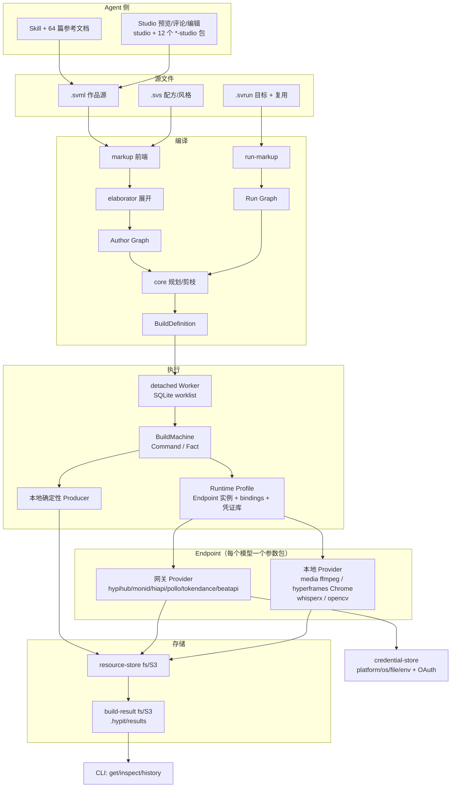
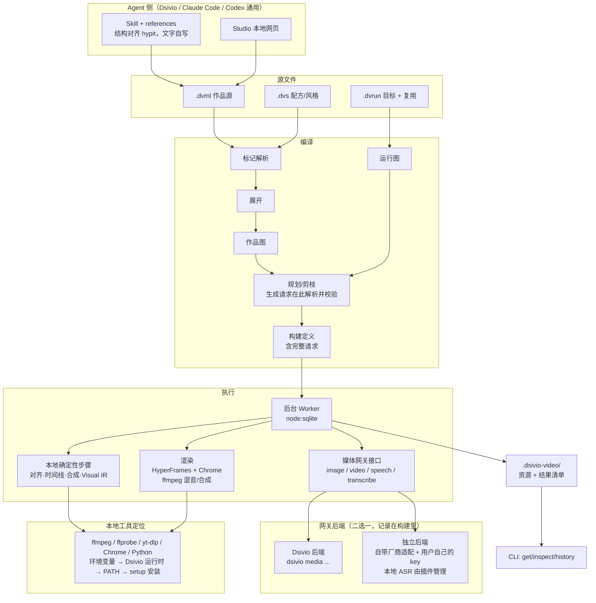

# dsivio-video 架构

dsivio-video 是一个由 Agent 驱动的视频制作插件。流程和分层对齐 hypit；行为规格见 [research/](research/README.md)。本文件是架构的唯一维护入口。

## 1. 对照：hypit 的架构



hypit 自己对接各家服务，所以每个模型用一个包固定参数表，由 Runtime Profile 选择由哪个网关实现，密钥放在自己的凭证库里。

## 2. dsivio-video 的架构



### 2.1 与 hypit 的对应

| hypit | dsivio-video | 差别 |
|---|---|---|
| markup / svs / run-markup / elaborator | 标记解析、展开 | 同构；扩展名和命名空间换成 `.dvml`/`.dvs`/`.dvrun`、`dsivio-video/<包>@1` |
| core / run / BuildMachine | 规划、构建定义、Worker | 同构；一个 Node 包内按目录分层，不拆 122 个包 |
| runtime-local + store-sqlite | Worker + `node:sqlite` | 同构 |
| build-result-fs / resource-store-fs | `.dsivio-video/` | 同构；去掉 S3/Lambda |
| 每模型参数包 + endpoint-kit + Runtime Profile bindings | 媒体网关接口 + 两个后端 | 生成元素通用（`gen:Image`/`gen:Video`/`gen:Speech`），`model=` 必填，plan 时按后端给出的模型参数描述校验并展开完整请求 |
| 6 个网关 Provider + 凭证库 + OAuth | Dsivio 后端；独立后端带少量直连适配 | Dsivio 模式插件不持有任何 key |
| provider-whisperx-local / opencv-local | 媒体网关的 transcribe 能力；本地 ASR 服务 | Dsivio 模式由 Dsivio 安装和托管 |
| provider-hyperframes-local / media-local | 渲染、本地工具 | 同构；工具优先用 Dsivio 内置运行时 |
| 18 个组件包 + 12 个 *-studio 包 | 组件目录，编辑能力并入 Studio | 功能对齐，去掉重复发布结构 |
| skills/hypit | skills/dsivio-video | 结构对齐，文字自写，模型经验按 Dsivio 实际模型写 |

### 2.2 媒体网关

插件内只有一个接口，四种能力：

| 能力 | 输入 | 输出 |
|---|---|---|
| image | 模型 id + 参数 | 图片 |
| video | 模型 id + 参数（首尾帧、参考图/视频/音频、时长、分辨率、比例、音频开关、模型特有参数） | 视频 |
| speech | 模型 id + 文本 + 音色/参考音频 | 音频 |
| transcribe | 媒体 + 语言 | 带逐字时间的转写 |

每个后端都提供同一形状的「模型参数描述」：参数名、类型、取值、是否必填、条件约束。规划器只读这份描述，不写任何按模型的代码。

后端选择：
- 项目配置 `gateway: auto | dsivio | standalone`，默认 `auto`：Dsivio 能连上就用 Dsivio，否则用独立后端。
- 选择发生在 plan，结果写进构建定义；一个构建执行中途不换后端。plan 输出里显示用的是哪个后端和哪个模型。

**Dsivio 后端**：调用 `dsivio media image|video|speech|transcribe`，模型、密钥、队列、幂等、本地 ASR 的安装和托管都归 Dsivio。任务通过 `--idempotency-key` 和 `--source dsivio-video` 提交；退出码 5 不重提，6 等待 Dsivio 打开后继续。

**独立后端**：给 Claude Code / Codex 等不在 Dsivio 里的环境用。
- 密钥从环境变量或 `~/.dsivio-video/gateway.json` 读取。
- 首批直连适配器按实际需要选择少量厂商，每个适配器自带它的模型参数描述。
- 本地 ASR 通过 `dsivio-video setup asr` 安装到插件数据目录。

### 2.3 本地工具

ffmpeg、ffprobe、yt-dlp、Chrome Headless Shell、Python 的查找顺序：
1. `DSIVIO_VIDEO_<工具>` 环境变量；
2. Dsivio 暴露的内置运行时目录；
3. PATH；
4. `dsivio-video setup` 安装到插件数据目录的固定版本。

找不到时明确报错并给出安装命令，不在渲染或构建过程中临时联网下载。

### 2.4 本地 ASR 服务

逐字对齐是「跟着字走」的基础。服务代码只有一份，放在本仓库 `services/asr`（我们自己写的 WhisperX 封装，本地 HTTP）。
- Dsivio 模式：Dsivio 在「媒体创作」里把它作为一个本地提供方，使用 dsivio-video 时自动安装，也可在设置里手动安装；由 Dsivio 启停。
- 独立模式：插件自己安装和启停。

### 2.5 Studio 的实际归属

`src/studio/session.ts` 持有一次 Studio 会话的编译版本、显示闭包与发布状态；HTTP/SSE 服务只暴露带版本的快照与受 token/Host/Origin 保护的编辑入口。显示准备复用 Build executor 和本地缓存，不创建第二套生成队列，也不在预览中提交付费 Need。

`compileAuthorDetailed` 同一遍历产生作品图和 AuthoringIndex，记录精确 UTF-16 源码位置、真实引用及消费者输入端口。各模块 colocated `studio.ts` 提供领域事实、参数 owner 与允许的时间逆变换；通用 Inspector/Timeline 不按领域硬编码写源码。编辑先校验来源版本与 overlay 编译，成功再原子发布；共享 Recipe/Window 修改归原声明。

浏览器采用原生 ESM Preact/htm，共享 state/api/transport；预览在不授予同源权限的 sandbox iframe 中运行可信内置 renderer，主 UI 的会话 token 不传给预览。独立 AudioTrack 播放与视频解码就绪一起控制 transport。Timeline 的可拖边界保存用户高度，小窗口为 stage 留出空间；窄 band 仍保留几何与可选中区域，只隐藏放不下的标签，hover/zoom 显示内容。

评论持久化在独立 `FEEDBACK.json`，拥有自己的版本与冲突检查；任务/产物库读取既有 BuildStore/ResultsRepository，显示名属于输出清单，不修改 Candidate 或生成请求。实现/实测记录见[第 5 阶段 §13](design/phase5.md#13-实现与验收记录)。


## 3. Dsivio 侧需要的改动

| 改动 | 目的 |
|---|---|
| `dsivio media` 增加 `speech`、`transcribe` | 媒体网关的四种能力齐全 |
| 媒体创作设置增加语音模型与本地 ASR 提供方，支持自动安装/手动安装 | 语音和转写可配置 |
| 每个模型输出通用参数描述，并让请求真正接受这些参数 | 模型特有参数可用；当前云端请求拒绝未知字段（`media_generation.rs` 的 `deny_unknown_fields`），`_shared/dsivio.md` 的「原样合并」说法需要同时修正 |
| `dsivio media cancel`；价格信息（能给就给） | 取消远程任务；plan 显示价格 |
| 把内置 video-runtime（ffmpeg、ffprobe、yt-dlp、Node、Python）暴露给插件 | 插件不用自己装这些 |
| 市场新增 `dsivio-video` 内置条目，支持从仓库子目录安装；setup Skill、项目提示词 | 在 Dsivio 里一键安装 |

## 4. 目录结构

```text
plugins/dsivio-video/
  .kivio-plugin/plugin.json
  package.json                # Node ≥22.18，直接运行 .ts，无编译步骤
  bin/dsivio-video.mjs
  src/
    markup/                   # .dvml / .dvs / .dvrun 解析
    elaborate/                # 展开成作品图
    plan/                     # 规划、剪枝、构建定义
    build/                    # Worker、SQLite、结果目录
    gateway/                  # 媒体网关接口 + dsivio / standalone 后端
    components/               # 各组件：元素定义、展开、渲染
    timeline/                 # Script、语义 Take、Timeline、Temporal
    render/                   # Visual IR、HTML、HyperFrames、音频
    media/                    # probe/cut/frames/tile/tiles/boundaries/fetch
    tools/                    # 本地工具定位与 setup
    cli/
  services/asr/               # 本地转写与逐字对齐服务（Python）
  studio/                     # 本地网页
  skills/dsivio-video/        # SKILL.md + references/
  docs/
```

## 5. 阶段

1. **核心**：标记解析、check、vocabulary、`.dvrun`、plan/build/status/inspect/get/history/cancel、Worker 与结果目录、媒体网关接口与 Dsivio 后端（image/video）。
2. **素材工具**：media 系列命令、本地工具定位与 setup、transcribe（ASR 服务）。
3. **时间线与渲染**：Script、语义 Take、Timeline、画布与合成、Visual IR、HyperFrames、混音合成、snapshot。
4. **组件与 Skill**：18 个组件；Skill 与参考文档。
5. **Studio**。
6. **独立后端**：直连适配器与模型参数描述。

Dsivio 侧改动按阶段需要穿插：阶段 1 需要运行时暴露和市场条目；阶段 2 需要 transcribe；阶段 3 前需要 speech 和通用参数描述。
