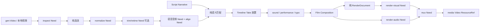

# 第 3 阶段设计：时间线与渲染

对应 Script、时钟、空间、媒体归一化、语音语义准备、Timeline、三个基础轨道、Film、HyperFrames 渲染、snapshot 与浏览器 capture。行为依据 [research/03](../research/03-timeline-speech.md)、[04](../research/04-composition-render.md)、[05](../research/05-tracks-components.md) 及 [06 §2.9/2.11](../research/06-media-tooling.md)。本文是第 3 阶段的实现合同，已全部实现；实现中做的调整和实测结果见 §11。其余十五项组件在第 4 阶段接同一终端合同，不另造轨道协议。

## 1. 共享契约与执行边界

| 文件 | 唯一负责的规则 |
|---|---|
| `src/core/value.ts`（已有） | `Json`、`Value`、`TypeRef`、`ResourceRef`；所有跨图/持久化数据仍是 `Value {type,data}` |
| `src/core/module.ts`、`capability.ts`、`graph.ts`（已有） | `ModuleDef`、`ProducerDef`、`NeedRequest`、即时 `CapabilityDef`、纯构建状态机；不改变 Phase 1 的端口和 Fact 协议 |
| `src/timeline/types.ts` | Narrative、段/Selection/Moment 引用、CaptionDocument、Clock、SynchronizedMedia、SemanticTake、Timeline/Placement、Instant/Window |
| `src/timeline/math.ts` | `frameToSample48k(frameBoundary, clock): number`，48 kHz 帧边界唯一算法；`validateClock` |
| `src/space/types.ts`、`math.ts` | Canvas/Frame/Extent/Point/Path、长度/锚点/ContentFit；`resolveFrame` 与 `fitContent` 唯一摆放公式 |
| `src/pipeline/types.ts` | 检查/选流、Normalize/Transform、规范 WAV、16 kHz 语音音频与整数采样 Evidence，以及请求形状 |
| `src/fonts/types.ts` | 精确 Face/Stack、FontFaceRequest、字体发行 pins |
| `src/components/types.ts` | Sound/Performance/Typography 的 Style、Program、Motion；不含执行逻辑 |
| `src/render/ir.ts` | Visual IR、TextFormat/Paint、Present、VisualTrack/AudioTrack、Composition/RenderDocument 与类型地址 |
| `src/render/requests.ts` | 视觉/音频/mux/逐帧请求及返回、浏览器与 npm 版本 pins |

这些对象都是 JSON 数据形状，不是另一套 Value 或 Artifact。字节仅使用 Phase 1 的 `ResourceRef {$resource,bytes,mime}`，绝不存本机路径、Chrome 实例、临时 URL、函数或 BigInt。可选字段省略，禁止写入 undefined；生产者构造 JSON 时只加入实际存在字段。BigInt 仅活在纯数学函数内部；输出整数必须仍在 JS safe integer 域。每个 ModuleDef 类型的 `validate(data: Json)` 必须实际验证结构和不变量，不能以 TS 类型断言代替。

**Producer 保持纯。**解析、选流、匹配、时间投影、轨道 lowering、Film 汇总、HTML 编译都只消费输入 Value。probe、FFmpeg、ASR、字体文件读取、Chrome、资源入库由 `NeedRequest` 请求即时本地 CapabilityDef。`resolve` 校验/展开请求，返回 `backend:"local"、cost:"local"`；输入 Pending 时保留它，不 probe 未产生的文件。Worker 是 Build 内唯一执行者，执行器只在 `ExecuteContext.workDir` 写临时文件，完成验证后用 `ctx.store.putFile` 入库。一次端口只能被输出或 need 满足一次；Normalize 的多个媒体成员包在一个 Value 中，不拆成多端口异步回填。

身份由生产者决定，不用当前时间或随机数：storyKey 取规范化作者结构的稳定摘要；Token/Segment/Anchor 身份取该结构内的确定路径，Moment/Selection 只绑定既有 Anchor。axisKey 取 Timeline 的作者位置与规范化放置计划摘要。组件实体身份取限定来源名/元素 id/声明序号；具体哈希编码在 `timeline/identity.ts` 一处实现，其他模块不重算引用身份。资源 id 仍是资源库的 opaque id，不冒充内容哈希。

**依赖方向：**`cli/build → modules（图声明）/capabilities（本地执行） → timeline/space/fonts/components/render 的业务函数 → core`。纯数据层为 `space/types、fonts/types → core/value`，`timeline/types → space/types + core/value`，`pipeline/types → timeline/space + core/value`，`render/ir → timeline/space/fonts + core/value`，`components/types → render/ir + timeline/space`；只有 type import，没有运行时反向环。纯算法/模块不得依赖 tools/ASR/Chrome；执行器可依赖 Phase 2 的 tools/asr、资源库接口和第三方包，不 import CLI/build 实现。Film/IR 验证、渲染器不 import 任何具体组件；共享文本 runtime 是终端 TextFlow 的解释器，不读 Typography Style/作者 XML。core/markup 不依赖第三阶段目录。

## 2. 模块、导入地址与 TypeRef

以下 `#Name` 均接本行完整地址（例如 `dsivio-video/time@1#Timeline`），不使用跨模块别名。输出裸 id 表示静态记录或一个命名产品；`.xxx` 表示公开端口。`visual` 地址只发布共享终端类型，轨道输出仍使用它，避免 Film 要认识每个组件。

| 地址 | surfaces（作者元素） | TypeRefs / 输出 |
|---|---|---|
| `dsivio-video/script@1` | `Script(id)`，raw 正文 | `#Narrative`（裸 id）、`#SegmentRef`（`.segment.<name>`）、`#SelectionRef`（`.selection.<name>`）、`#MomentRef`（`.moment.<name>`）、`#CaptionDocument`（`.caption`）；`.speech/.dialogue` 和每段同名视图用已有 `text@1#Text` |
| `dsivio-video/program@1` | `Clock(id,frame-rate)`，空 | `#Clock`，裸 id |
| `dsivio-video/space@1` | `Canvas`、`Frame`、`AnchoredFrame`、`AspectFrame`、`ContentFit`、`Extent`、`Point`、`Path` | `#Canvas/#Frame/#Extent/#Point/#Path`，裸 id；后三种 Frame 构造与 ContentFit 都输出同一个 `#Frame` |
| `dsivio-video/pipeline@1` | `Normalize`、`Transform`（子 `Trim/Retime`）、`ExtractAudio`、`ExtractFrame`、`StillVideo` | `#Inspection/#StreamSelection`（内部）、`#TransformPlan`、`#SynchronizedMedia`（`.media`）、`#NormalizedAudio`（`.audio`）；抽帧 `.image` 与静图成片 `.video` 复用 `media@1#Image/#Video` |
| `dsivio-video/align@1` | `SemanticTake`、`Adjust`（子 `Anchor`） | `#SpeechAudio/#Evidence`（内部）、`#SemanticTake`（`.take`）；校准仍输出该类型 |
| `dsivio-video/time@1` | `Timeline`（子 `Take`）；`Instant/Window`（显式共享时间值） | `#Timeline`（裸 id）、`#Instant/#Window`（裸 id）；Take 是放置声明，无第二个 Take 类型 |
| `dsivio-video/fonts@1` | `Face`、`Stack`（子 `Fallback`） | `#Face/#Stack`，裸 id |
| `dsivio-video/sound@1` | `Style/Track/Use` | `#Style/#Program`；Track `.program`，`.audio:visual@1#AudioTrack` |
| `dsivio-video/performance@1` | `Style/Track/Use` | `#Style/#Program`；Track `.program`，`.visual:visual@1#VisualTrack` |
| `dsivio-video/typo@1` | `Style/Motion/Track/Point/Area/Path/P/Span/Break/Mask`；Style 下的 Paint/Axis/Feature/Decoration，Motion 下的 ItemKeyframe/PathKeyframe/Sequence/Keyframe | `#Style/#Motion/#Program`；Track `.program`、`.track:visual@1#VisualTrack`，Mask `.track` |
| `dsivio-video/visual@1` | 无 | `#VisualTrack/#AudioTrack/#Surface`；IR 版本 `dsivio-video.visual/1` |
| `dsivio-video/film@1` | `Film/Track` | `#Composition`（`.composition`） |
| `dsivio-video/render@1` | `Video` | `#RenderDocument/#SilentVideo/#MixedAudio/#FinalVideo/#CapturedFrames`（内部）；作者只导出 `.video:media@1#Video` |

`gen:Video` 和 `media:Image/Video/Audio`、Recipe/Text 沿用现有模块。生成必须显式 model，plan 按实时网关描述校验；本地 renderer 不增加网关生成能力。所有非 raw 元素拒绝未知/重复属性、错误引用类型和未列出的子节点。

### 2.1 作者属性与产物映射

- Script：`id` 唯一必填属性。裸 Segment 标签、Role、Dual Text、`||`、词属性、`@{range}`/`@{cue!}` 的词法及亲和方向按 research/03 §2.1；前端直接发布纯静态 Value，因此 `{story.segment.intro}` 在展开后即可引用，不要求执行 Build。Narrative 不含模型、帧或外观；段摘录引用必须与 Narrative 的完整段逐字段吻合。
- Clock：`frame-rate="30"` 或 `"30000/1001"`；不收小数 FPS。保留作者分子/分母，不约分，Timeline/Take 时钟仍逐字段相等；边界数学允许等价比值得到相同采样数。
- Canvas：`id,width,height`，正安全整数。Frame：`id,within,left,top,right,bottom`，边长只收带单位 px/%；within 引用 Canvas 或 Frame。AnchoredFrame：`id,within,x,y,width,height,anchor`，可选数值 `offset-x/y=0`；AspectFrame 以 `aspect`（正宽高比或 Extent 引用）加 width/height 恰一个代替双尺寸。ContentFit：`id,frame,extent`，可选 `fit`、`frame-x/y`、`content-x/y`、`offset-x/y`、`constraint`，分别映射 ContentFit 字段。Extent：`id,width,height`（正有限像素）。Point：`id,within,x,y`，可选 `anchor-x/y=0.5`；累计 Canvas 原点。Path：`id,within,x,y` 和有序空 `Line(x,y)`、`Quadratic(cx,cy,x,y)`、`Cubic(c1x,c1y,c2x,c2y,x,y)`，长度均 px/%；转换为 Canvas 坐标 Path。Path 不关闭/填充任意 SVG，仅用于排字。
- Normalize：`id,source`；时钟 `clock` / `frame-rate` 恰一个；策略 `recipe` 或完整 `video,audio,span-authority` 三项恰一个。source 只允许已有 media Image 之外的 Video/Audio 资源，静图先 StillVideo；选流规则见 §3。导出 `.media`。
- Transform：`id,source`（SynchronizedMedia），至少一个按序 Trim/Retime。Trim 的 `start-frame=0` 与 `end-frame-exclusive`（省略=当前末尾）使用上一步局部整数帧；Retime 的 `speed` 为正整数比值或整数，`preserve-pitch` 固定 true，不提供变调入口。必须在 SemanticTake 前执行；source 不接受 Take。ExtractAudio：`id,source,stream-index`；ExtractFrame 再加 `position=first|last|frame:<n>|seconds:<十进制>`；StillVideo：`id,image,clock,frames`。三个元素均空。
- SemanticTake：`id,narrative,segment,media`，带词段必填 `language`（小写两/三字母，非 auto/und）；空段禁止附带无用的 language，直接物化。Adjust：`id,source`，至少一个空 Anchor `at={MomentRef},frame=<Take局部帧>`；与 Timeline 放置/媒体变换无关。
- Timeline：`id,clock`（也可 frame-rate 恰一个）、可选 `end`；至少一个 Take 或显式正 end。Take：`source={SemanticTake}`、可选 `id/at`；首个 at 默认 0f，其余 previous.end；省略 id 按声明序号派生。不导出画面/声音轨道。Instant/Window：`id,timeline` 加 research/03 §2.5 对应 I/W 属性集；consumerKey 为该元素限定身份。
- Face：`id,family,weight,style`，空；Stack：`id,font={Face}`，可选 `emoji=color|mono`，子 Fallback 只收 `font={Face}`。所有字体字节明确准备，不查系统字体。
- Film：恰好 `id,canvas,timeline,appearance={Recipe}`；至少一个空 Track，唯一属性 source，类型为 VisualTrack/AudioTrack。appearance 必须只有 background（六/八位十六进制色），无默认。composition 持有所选 Timeline 的 ProgramDomain，不重建浮点时钟。
- render:Video：恰好 `id,composition,timeline` 加可选成对 `start-frame/end-frame-exclusive`，空；默认全片。Composition 的 axisKey/clock/totalFrames 必须与 Timeline 相等。输出 MP4 字节，不把 HTML 作为 `.video`。

模块文件按现有 `src/modules/<name>/index.ts` 写 ModuleDef；算法放业务目录。surface 只做解码、绑定和 `ctx.record/operation/asset`，不偷偷开启浏览器或 subprocess。未来第 4 阶段新增组件只产上述 VisualTrack/AudioTrack/Surface；不得让 Film/render 导入它们的 Style。

## 3. 时间、媒体、空间与轨道不变量

### 3.1 Narrative → SemanticTake → Timeline

Narrative.tokens 是全篇作者顺序；Bounds 统一半开，但 token/frame/sample 是不同域。每个词、段、节目各拥有两个不同 Anchor，不能把重合 Anchor 合并。Turn 的 role 可缺省；CaptionUnit 的显示字符串/原 separator/平面属性和 tokenBounds 保留 N:M 对应，Cue 持 unitKeys；字幕内容不从识别结果重新生成。Selection tokenBounds 用于内容查询，物理起止只能从其两 Anchor 找；Moment 只绑定一个 Anchor。

带词段链路：48 kHz 主音频 → `local/speech-audio`（16 kHz mono PCM16，精确补裁）→ `local/align`（ASR+声学 alignment Evidence）→纯 `align#materialize`（Script 匹配）。Evidence 坐标是 16 kHz 整数采样边界，词/字符的 samples 要么起止齐全要么省略，confidence 缺省不是零；保留重叠、零宽、反向测量，但只有正跨度参与定位。字符 wordIndex 指向同 block 的 words；voiceRegions 在同一个采样域。Phase 2 的 transcript JSON 经过毫秒/秒数舍入，**不能作为精确 Evidence 的替代品**；复用 ASR 原始响应适配，不从文件倒推样本。

匹配与插值算法由 `timeline/align.ts` 一处负责，完整采用 research/03 §2.3 的分组 DP、精确任意长度 split/merge、模糊每侧最多 4 Token、成本 0/0.055/0.5/0.35、可靠系数/字符 Levenshtein/LCS、1e-9 平局规则、缺词加权插值，以及 floor/ceil 采样触帧投射。没有翻译、简繁/拼音匹配、均分全部词或自动可信度门限。初次物化词窗口至少一帧；Adjust 可变成零宽，仍要求起/终序列单调、Anchor 和 Token 一致。段 Anchors 固定在 0/F，节目 Anchor 不进入 Take。空段映射段边界到 0/F，不派生语音或调用 align；其媒体仍是真实已归一化素材。

**中文繁简（定案）：** 实测 `small` 模型对中文常输出繁体，与简体脚本逐字不同，匹配会大面积失败。处理放在识别端：ASR 服务对 `zh` 请求加简体中文的初始提示，让识别结果偏向简体（第 2 阶段 ASR 负责人修改 `services/asr`，服务版本升到 0.2.0）。匹配算法仍不做简繁或拼音转换。识别结果仍出现繁体时，按普通不匹配处理并在诊断里如实报告，不在匹配里偷偷折叠。

Timeline.placements 保留声明序；局部帧 k 放置到 offsetFrames+k。全部 Take 同 storyKey/Clock，不能重复 Segment/Token/Anchor；content.end 是最大结束，不是最后声明结束。at/end 的 f/ms/s 运算必须精确整帧且非负，end 正且包住所有 Take；previous.end 只指紧邻前一声明。无 Take 时要求正 end、没有 storyKey/storyAnchors。节目 Anchor 定位为 0/T。

Temporal 只支持一个带明确单位的绝对时长，或 `program.start/end、selection.start/end、segment.start/end、moment.cue` 加减**一个**时长。不接受乘除、科学计数、裸数、负绝对值、分数帧；f/ms 是非负整数，s 允许普通十进制小数但不能 `.5s`。精确有理计算后先检查 0…T，再 round-half-up 到帧，不能裁回边界。W 的 during / at+for / until+for / start+end 恰一种，语义绑定不能闲置；I 引用 Segment/Selection 时显式 boundary。窗口端点保留各自 origin/expression/editAuthority，axisKey 和 consumerKey 必须一致，量化后 end>start。组件解码 W 时 consumerKey 用其 Item/Use 身份；引用共享 Window 时复制消费归属但不篡改语义原点。sibling disjoint 检查、触发点/terminal 调度规则也集中在 `timeline/temporal.ts`，不由每个组件重写。

### 3.2 Normalize 与 Transform

检查要返回所有容器流及有效起点/时长，不能只用容器 duration。纯选流步骤按 research/03 §2.2 的唯一 default / 唯一候选规则；primary-moving 排除封面/静态/无时间，audio=default 无音频时失败；显式索引同样验证有效性。两个 none、关闭权威、歧义全部失败。含画面只允许 video authority；audio authority 仅音频专用。

视频权威 F=round-half-up(d×p/q)，音频权威 F=ceil(d×p/q)，均至少一帧。权威流起点成为共同局部零点，所选音频按相对起点裁头/补头、裁尾/补尾；完全无交集失败。画面 CFR、准确 F 帧、方像素、固化旋转；opaque 为 H.264 MP4，straight alpha 为保透明 VP9 WebM。主音频 48 kHz stereo PCM s16 WAV，样本数 B(F)，保持输入电平。SynchronizedMedia 至少一成员；picture 有资源/extent/alpha，sound 有资源/totalSamples=B(F)。选择/补裁账本留在操作日志，不混入公共媒体值。

Transform 按作者顺序执行，每一步位置属于上一步结果。Trim 是非空、域内整数帧区间；Retime 新 F=round-half-up(F/speed)，至少一帧；视频采样改变与音频 atempo 保音高同步。输出仍是 SynchronizedMedia，时钟不变、PCM 音频重新裁补到 B(F)。透明画面保透明，音频专用媒体也有效。不得接收已对齐 Take 后偷偷改长短。

### 3.3 空间数学

`Rect {xPx,yPx,widthPx,heightPx}` 为累计 Canvas 坐标。Frame 四个边按父宽/高解析 px/%：x=X+left、y=Y+top、w=right−left、h=bottom−top；right/bottom 不是 inset。允许越出父框，只拒绝非有限/非正尺寸。嵌入 IR 父盒子时减父原点一次，禁止重复累计。

AnchoredFrame：锚点 a,b∈{0,0.5,1}，x=X+x指定−w×a+offsetX，y 同理；九个名字使用 types.ts 的 `top-left/top-center/top-right/center-left/center/center-right/bottom-left/bottom-center/bottom-right`。AspectFrame 给 width 时 h=w/aspect，给 height 时 w=h×aspect，然后同式摆放。

ContentFit contain=min(W/Iw,H/Ih)、cover=max、fit-width/height 取单轴、native=1、scale-down=min(1,contain)、stretch 两轴独立。内容原点=`框原点+框尺寸×frameAnchor−内容尺寸×contentAnchor+offset`。bounded 夹在 min(框起点,框末−内容尺寸)…max(同两端)，所以大内容与小内容都正确；free 不夹。默认 contain/双方中心/零偏移/bounded。输出只是一矩形，clip 的所有权在组件。

### 3.4 三个基础轨道

完整属性白名单、Recipe 默认和 Paint/Motion 规则以 research/05 §2.4、§2.7、§2.8 为准；以下是我们固定的数据映射和优先级，不另开一个简化 Track 方言。

- **sound**：Style `id,gain=1,end-gain=gain`，0…64。Track `id,timeline`；Use `id（派生）,style,W（缺省全节目）`，可零 Use。Program 的 uses 保声明序。先按 Timeline **后声明的有声 placement 胜出**，再按 **后声明 Use 胜出**；gain=endGain=0 也遮掉前 Use。输出 AudioClip 保留完整 target/sourceSamples、全局 gainCurve 与 audible 子区间，恢复时不重启源相位/增益。每个 Use 的 gainCurve 在完整窗口两端线性插值。没有现成声音不自动生成；不同 Sound Track 最终混音相加。
- **performance**：Style `id,frame,appearance={Recipe}`；appearance 使用 research/05 的拟合、颜色滤镜、opacity、外框/padding/border/radius/shadows/frame-paint 键，禁止 playback/trim 和独立 motion。映射到 PerformanceStyle 的 fit、contentInsetPx（上右下左，含边框）、outerStyle、framePaint、clip/radius。Track `id,timeline,canvas`；Use 同 sound，零 Use 合法。每个画面 placement 与 Use 相交时生成保留原媒体寿命/原速采样的 Present；后 Use 只改 visible，不从源第一帧重播。无 picture 的 placement 跳过，绝不造头像/黑视频替代。普通重叠源保留各自 Present，以声明序形成稳定 layerKey；Use 的覆盖和跨轨 stacking 分开。
- **typo**：Style `id,recipe,font`；准确 Face 或非空 Stack。Track `id,timeline`、至少一 Point/Area/Path：`id,placement,style,motion?,content?` 和必选 W；content 引用 Text 与正文互斥。正文纯文字或 P；P/Span/Break 的富文本与换行保留，P/Span Style 完整替换 format/paint，不局部继承字体。Program.items 持解析后的 TextFlow、Style 与 Motion、具体 Point/Frame/Path；窗口只是独立文字寿命，不冒充词级字幕时钟。Style 的几何/layout/path 参数不进入局部 run。Exact Face 持 weight/style，Recipe weight/font-style 若存在必须匹配主 Face；缺省采用主 Face，synthesis 必须显式且不能掩盖缺文件。Motion 的 color 及单元/路径变化由文本程序 seek 实现，不能混进只允许五类属性的结构 Keyframe。Mask 仅接静态 Surface 和 research/05 §2.4 规定的 Area/单段/无富 run/无 Sequence/固定双轴/单列/横写/无 decoration 子集，不符合则拒绝。

三种 `.program` 是可 inspect 的作者计划，`.audio/.visual/.track` 是各自纯 lowering 后的终端轨道。共享 Style 不是复制到每个 Use 后可独立修改的隐含副本。项目自有 Fragment/任意插件 JS 的扩展没有在 Phase 1 的 ModuleDef 中定义，第三阶段不增加动态扩展加载（差异见 §8）。

## 4. Visual IR、Film 与渲染链路

### 4.1 终端结构与校验所有权

`render/ir.ts` 的九个 kind：box、image、video、surface、text、text-flow、path-text、mask、program。每个 Present 恰一个 root；nodeKey/order 全树唯一，order 非负安全整数，parentKey 只能指同树 box/mask/program，无循环。mask 恰两个直属根，maskRoot 是终端文本/image/still surface、无子树。Style 用有序 declaration 数组，重复 property 拒绝；白名单在 STYLE_PROPERTIES 一处，禁止分号/花括号/控制字符/!important/var/env/attr/url/image-set 等环境或隐藏资源入口。HTML 属性仅 data-/aria-/role/title/lang/dir。字体 family/weight/style 不进入结构 Style，全部由精确 TextFormat 管。

Keyframe 相对 Present 起点，至少两帧、offset 非负安全整数且严格递增、每帧非空，仅 opacity/transform/filter/backdrop-filter/clip-path，四种 Easing；动画持续=max(Present长度,末偏移)，不足补最后姿态。显式 sampling 的 video 本身不附 keyframes，运动包在外 box。Sampling sourceStart/sourceStep 是有理数，step≥0；目标 piece 有序不重叠、局部域内，源帧=floor(sourceStart+(k−target.start)×step)。循环先展开成有界段，phase 在有效源 loop 内；无循环首末采样必须在源帧域，缺口不显示。frames Surface 无 map 时源 Clock/F 必须吻合 Present。Surface 的字节、唯一视觉流、尺寸、alpha、方像素/无旋转/逐行/SDR sRGB/帧数/FPS 都由资源准备阶段实测，不靠扩展名相信声明。

循环的 phase 相对 sourceFrames.start，要求 sourceStart=sourceFrames.start+phase；实际源位置为 `sourceFrames.start + ((phase+(k−target.start)×sourceStep) mod 循环长度)`，先做有理 modulo 再 floor。编译器拆成无跨循环边界的段，不能让 phase/sourceStart 两份信息各有不同解释。空间 Path 是 Canvas 坐标；Typography lowering 时转成终端 TextPath（去 canvasKey 并减去本节点空间原点），C 的文本 runtime 只读 node-local 路径，E 不再次变换它。

Film 校验同 axisKey、Track identity 全局唯一（音画也不能同名），同 source 不重复；以 kind/trackKey 规范化集合。绘制 flatten 后按 `(layer,layerKey,lifetime.start,trackKey,presentKey)` 排序，后者盖前者；相同 layer+layerKey 的主体区间重叠即失败，不因 visible 分片不相交而放行。背景在所有视觉下方。AudioClip 在采样轴相加，无视觉 z；浏览器 video 永远静音。

资源依赖由编译器产 RenderDocument.resources：字体/Program 声明资源 required=global，图像/视频/surface 为保守 windows。重复 $resource 若 bytes/MIME 不一致即失败；占位 `dv-resource://<id>` 必须全部有清单记录。HTML 自含 reset、精确 @font-face、暂停动画、program scoped CSS/seek 脚本。Composition 根带 `data-composition-id`、`data-duration`、`data-dv-fps-numerator/denominator`、`data-dv-total-frames`、明确宽高；整数数据是时钟真相，seconds 只为第三方 API 适配。Document 不存入临时服务器地址。

Program 是内置可信组件的 `{format,html,css,setup,data,resources}`：child slot `{{nodeKey}}` 恰好安放所有直接子节点，CSS 以根 @scope 限定；setup 返回同步 draw(localFrame)，Promise 是错误。每次原帧 seek 独立求状态，重复/逆序/中段首次 seek 都不得依赖之前帧；不得用 Date、未 seed 随机、计时器、网络时序作姿态输入。只准备与选区相交的 Program，但全局声明资源先准备好。第三方引擎不是 JS 沙箱。

### 4.2 Producer 图与能力清单

所有返回均为已有 `Value`，表中返回列写 `Value.data` 的 TS 类型与 TypeRef；请求写 `NeedRequest.request` 的形状。完整请求经过 resolve 后固定进入事实；本地执行不会换选流、FPS、浏览器版本或模型。

| Capability（全部 immediate） | request | response data / TypeRef | 发 need 的 Producer（模块内名字） |
|---|---|---|---|
| `local/inspect` | `{source:ResourceRef}` | `Inspection` / `pipeline#Inspection` | `pipeline#inspect-video/#inspect-audio`：各自有准确 nominal source 端口→inspection |
| `local/normalize` | `NormalizeRequest {selection,clock}` | `SynchronizedMedia` / `pipeline#SynchronizedMedia` | `pipeline#normalize`：selection+clock→media；selection 由纯 `#select` 产生 |
| `local/transform` | `TransformRequest {media,plan}` | 同上 | `pipeline#transform`：source+plan→media |
| `local/extract-audio` | `ExtractAudioRequest {source,streamIndex}` | `NormalizedAudio {resource,totalSamples}` / `pipeline#NormalizedAudio` | `pipeline#extract-audio-video/#extract-audio-audio` |
| `local/extract-frame` | `ExtractFrameRequest {source,streamIndex,position}` | `ResourceRef` / `media#Image`（PNG） | `pipeline#extract-frame` |
| `local/still-video` | `StillVideoRequest {image,clock,totalFrames}` | `ResourceRef` / `media#Video`（无声 CFR）；需要同步媒体时显式 Normalize | `pipeline#still-video` |
| `local/speech-audio` | `SpeechAudioRequest {sound,totalSamples16k}` | `SpeechAudio` / `align#SpeechAudio` | `align#speech-audio`：media→audio；样本数=round-half-up(B(F)/3) |
| `local/align` | `AlignRequest {audio,language}` | `AlignmentEvidence` / `align#Evidence` | `align#evidence`：audio+language→evidence；执行器复用 Phase 2 的本地 ASR 服务 |
| `local/font-face` | `FontFaceRequest {faceKey,family,weight,style}` | `FontFace` / `fonts#Face`（含 WOFF2/许可资源） | `fonts#face`；读已准备目录并存资源，不下载 |
| `local/render-visual` | `RenderVisualRequest {document,frames,quality}` | `SilentVideo` / `render#SilentVideo` | `render#visual` |
| `local/render-audio` | `RenderAudioRequest {domain,tracks,frames}` | `MixedAudio` / `render#MixedAudio` | `render#audio` |
| `local/mux` | `MuxRequest {visual,audio}` | `FinalVideo` / `render#FinalVideo` | `render#mux`；纯 `render#video` 投影 resource 为作者 media#Video |
| `local/render-frames` | `FrameCaptureRequest {input,frames}`（document 或 localized HtmlProject 恰一个） | `CapturedFrames` / `render#CapturedFrames` | snapshot 即时调用；不建 Producer/Build |

上表 `pipeline#Name` 等 TypeRef 缩写仅用于阅读，实际完整值以 contracts 中常量为准。Phase 1 PortDef 不支持类型 union：surface 检查引用后选择 `inspect-video`（source:media#Video）或 `inspect-audio`（source:media#Audio），两者发同一 inspect need；不增加 alias/shim。Producer 端口名：inspect 的 `source/inspection`；select 的 `inspection,policy/selection`（policy:pipeline#StreamPolicy）；normalize 的 `selection,clock/media`；transform 的 `source,plan/media`；extract-audio 的两个源类型专用 producer 都收 `source,options/audio`（options:pipeline#ExtractAudioOptions）；extract-frame 收 `source:media#Video,options:pipeline#ExtractFrameOptions/image`；still-video 收 `image:media#Image,clock,frames:pipeline#FrameCount/video`。资源/时钟等未来值始终作为真实 typed input 端口，不在静态参数记录中藏图引用；Producer.run 取得它们后才构造请求。

SemanticTake 展开为三个有真实依赖的私有操作：speech-audio 的 `media/audio` → evidence 的 `audio,language/evidence` → materialize 的 `narrative,segment,media,evidence/take`；无词分支只调用 `align#empty(narrative,segment,media)/take`。Adjust 的 `source,edits/take` 是纯步骤；edits 为共享 `Adjustment`，内部 `align#Adjustment`。time#assemble 收 `clock,takes[],placements,end/timeline`：takes 端口逐项是 align#SemanticTake；placements:time#PlacementPlan 只含 `{placements:[{placementKey,at?}]}`，与 takes 按声明 index 一一对应；end:time#EndExpression 是可省略的表达式字符串，不能把未来 Take 嵌入静态 JSON。Take 的 storyAnchors 仅保留 Narrative 节目 Anchor 身份，不进入局部 anchorFrames，Timeline 用它们物化 0/T。temporal projection 收 `timeline,expression,consumer/window|instant`，表达式分别共享 WindowExpression/InstantExpression，consumer 为 time#ConsumerKey 字符串。

三轨道的 `#program` 明确端口：sound 收 `timeline,plan:UsePlan,windows[],styles[]`；performance 再收 `canvas`；两者 styles 列表使用各自 nominal Style。typo 收 `timeline,plan:TypographyAuthorPlan,windows[],styles[],motions[],points[],frames[],paths[],texts[]`；plan 的 index 指向对应 typed list，不越界、不夹带动态引用；Frame/Point/Path 各是独立 list，Text 复用 text@1#Text，未使用 list 传空数组。UsePlan/AuthorPlan 的 TypeRef 常量及形状在 components/types.ts，其他包不自行解释 XML；plan→Program 保持作者序并填入真实值，`#lower(program)` 输出 audio/visual/track。字体相关 Style surface 以 `#style-face/#style-stack` 区分精确 Face/Stack nominal 输入，不改变共享 Style 返回类型。Film `#compose` 收 canvas,timeline,appearance,visualTracks[],audioTracks[]，输出 composition。render#document 收 composition→document；render#visual 收 document,range,quality→visual；render#audio 收 composition,range→audio；render#mux 收 visual,audio→final；render#video 收 final→video。内部 range/quality 分别为 render#FrameRange（Bounds）/#Quality（RenderQuality）。**只有返回表所列 need 的步骤有 IO，所有其他 Producer.run 同步纯计算。** 内部参数 TypeDef 同样白名单校验，不把裸 Json 当可跳过验证的类型；它们不是作者任意 raw value 入口。

**身份端口（补充定案）：** 需要稳定身份的纯步骤，把作者元素身份作为一个 `time#ConsumerKey` 静态输入端口 `key` 传入（由 `timeline/identity.ts` 按「文件 + 元素 id」生成），不在运行时从内容猜身份。目前用到的有：`film#compose`（compositionKey）、`performance#style`（styleKey，另两个端口为 `frame`、`appearance`），以及各轨道的 `#program`（trackKey）。



空段从 Normalize/Transform 直接到纯 empty take；无变换时 Normalize 直接进入语音准备。render:Video 展开的 visual/audio 两个 need 可同时 ready，mux 依赖二者，不能由单个 render need 隐藏全部阶段。历史复用继续以公开 `.video/.take/.media/.composition` 和内部记录的实际 Value 为依据，不复用 browser session。

### 4.3 逐帧、48 kHz 混音与 mux

选区 `[s,e)` 要满足 0≤s<e≤T，video 输出帧数 e−s，浏览器始终 seek **原片**帧 f（s…e−1）。视觉选择资源/程序后所有 worker 共享一次准备；用有界源帧解码缓存和按整数采样 map 的源 PNG 注入，不指望 video.currentTime 自动准确。HTML 的 `__hf.seek(f×q/p)` 同步设置可见性/动画/Program；捕获前等待所选图片 decode、字体、注入帧 readiness 与 seek 错误传播。画面 PNG image2pipe 按准确有理 FPS 进入 FFmpeg；libx264、yuv420p、BT.709 TV range、faststart；quality 的 CRF=28/23/18，preset=draft veryfast，其余 medium。Canvas 仍允许奇数尺寸，**render-visual resolve 拒绝奇数宽/高**，不静默补边；snapshot 可保原尺寸。输出 probe 证明恰一 H.264 无音频流、画布尺寸/交叉乘 FPS/解码帧数正确。

**采样边界唯一合同：** `B(f)=round-half-up(f×48000×q/p)`，整数有理一次运算。完整节目是 B(T)；Clip/Window 在原时轴的样本长度为 B(end)−B(start)，不是每帧舍入累加。局部成片另有零基时轴：源偏移 B(s)，输出 WAV 样本数 **B(e−s)**。这是 research/06 §2.12 的 rebased 成片规则；research/04 的“两个绝对边界之差”为轨道窗口，不用于重建新影片总样本数。30000/1001fps，s=1,e=2：源窗口 1601 样本，新片需 1602；最后允许按零基目标精确补/裁一个样本，原相位/包络仍从 B(s) 读取，不重启。这一选择明确消除了两篇研究的长度歧义。

AudioClip 源是经 probe 的唯一 48 kHz stereo PCM s16 WAV，sourceTotalSamples 实测吻合；同资源声明样本数冲突失败。sourceSamples/targetSamples 为正半开区间，loop.phaseSamples 在裁后源窗内，speed 正有理，preservePitch=true，gain 0…64；fade 各不长于目标可听长度。gainCurve 为全局样本边界、非负 gain、严格递增，首尾覆盖 target；audible 子窗有序不重叠且在 target 内。流程：atrim 源窗 → 归零 → aloop/phase → atempo（极端速度拆 0.5…2）→ apad/atrim 精确目标 → gain/fade/逐样本包络/可听 mask → **最后**按原片选区裁切并 adelay（样本单位）到局部输出；amix normalize=0、dropout_transition=0 → 精确补裁 B(e−s) → 重建样本 PTS → WAV。无活动 clip 同样输出准确长度静音 WAV，无隐式响度标准化/压限/ducking。

mux 再验证 SilentVideo 与 MixedAudio，要求 audio.totalSamples=B(visual.totalFrames)。一视一音显式 map、视频 copy、音频 AAC 48 kHz stereo、faststart MP4，不用 -shortest 隐藏不一致。最终 probe 一视一音、起点一致、帧数不变；AAC 呈现长度与计划 WAV 差严格少于 1024 样本，不能扩大百分比容差。FinalVideo 保留计划 presentationSamples48k，render#video 只投影 resource。

渲染执行在可丢弃子进程；总截止默认 30 分钟，日志 4 MiB、乱序 PNG 队列 256 MiB、源帧工作集 1 GiB、输出 16 GiB；timeout/cancel/任一 worker 失败使此次执行失败，关闭浏览器/HTTP/FFmpeg 并清 scratch。第三阶段固定受限 workers，默认 1，显式 workers 为正整数且不大于选区帧数；约一秒批次动态领取、全局输出序排序，不能由完成顺序改变编码。多渲染由项目 Worker 的单一 browser capability 信号量串行入场，不引入新云池产品。

## 5. Chrome/HyperFrames 的准备、发行与 API 核验

### 5.1 固定依赖与许可证

2026-10-01 实际查询 npm registry 的 latest，并下载对应 tarball 阅读 README、package.json、公开 `.d.ts` 和 LICENSE。采用当前固定版本，不沿用 research/04 的旧 npm 三元组：

| npm 包 | 当前 latest / 本设计 pin | 核验证据与 API |
|---|---|---|
| `@hyperframes/engine` | **0.8.99** | [版本元数据](https://registry.npmjs.org/@hyperframes%2fengine/0.8.99)、[已发布 tarball](https://registry.npmjs.org/@hyperframes/engine/-/engine-0.8.99.tgz)：包内 LICENSE 是 Apache-2.0；npm 元数据仍**没有 license 字段**。README 讲 seek/capture，真实签名以 dist 的声明为准 |
| `@hyperframes/producer` | **0.8.99** | [元数据](https://registry.npmjs.org/@hyperframes%2fproducer/0.8.99)、[tarball](https://registry.npmjs.org/@hyperframes/producer/-/producer-0.8.99.tgz)：包内 LICENSE 是 Apache-2.0，元数据也没有 license 字段；公开 createFileServer 和高层 job API |
| `@puppeteer/browsers` | **3.2.3** | [元数据](https://registry.npmjs.org/@puppeteer%2fbrowsers/3.2.3)、[tarball](https://registry.npmjs.org/@puppeteer/browsers/-/browsers-3.2.3.tgz)：license=Apache-2.0，源码声明有 SPDX；install/computeExecutablePath/Browser.CHROMEHEADLESSSHELL |
| `puppeteer-core` | 固定 **25.8.0**（本次核验该版本，不称 latest） | [元数据](https://registry.npmjs.org/puppeteer-core/25.8.0)、[tarball](https://registry.npmjs.org/puppeteer-core/-/puppeteer-core-25.8.0.tgz)：Apache-2.0；engine 的依赖范围为 ^25.8.0，capture 自己显式依赖同版 |

engine/producer 要求 Node≥22，browsers/puppeteer-core 要求≥22.12；项目当前 ≥22.18 可满足。安装渲染 npm 依赖时 `PUPPETEER_SKIP_DOWNLOAD=true`，保存 exact pins 和 lockfile，锁定间接 `@hyperframes/core/parsers` 的 0.8.99（包括 producer 的 lint/studio-server 发行依赖），不在构建时解析 latest。保留第三方 LICENSE/NOTICE，不涉及 hypit 源码或模板。

**已核验的低层适配路径：**

1. producer `createFileServer({projectDir,port?,preHeadScripts?,headScripts?,bodyScripts?,fps?:{num,den},stripEmbeddedRuntime?}): Promise<{url,port,close,...}>`。只服务已准备 scratch 项目；明确 `headScripts:[],bodyScripts:[],stripEmbeddedRuntime:false` 保留自写 runtime，preHeadScripts 只注入原片选区。默认脚本是 HyperFrames 的整套 runtime，不能不加说明地覆盖我们的 seek。
2. engine `createCaptureSession(serverUrl,outputDir,options,onBeforeCapture?,config?): Promise<CaptureSession>`；`initializeSession(session)`；`captureFrameToBuffer(session,frameIndex,time): Promise<CaptureBufferResult>`；`closeCaptureSession(session)`。README 的简略对象调用示例**与本版真实声明不同**，实现者使用上述 positional signature。options.fps 是 `{num,den}`，由 Clock 字段转换，传 compositionDurationSeconds；视频的 metadata hints/skipReadinessVideoIds 与 out-of-band 注入对应。
3. config 明确 `chromePath、forceScreenshot:true、useDrawElement:false、enableDrawElementWorkerEncode:false、enableBrowserPool:false、staticFrameDedup:false`，不让第三方跳过重复 seek 或自行改变捕获路径；GPU 固定 software（可复现的默认）。CaptureOptions.format="png"，使用无损 PNG，不经过默认 JPEG/透明输出 orchestrator 分支。成功/失败都检查 capture result 和关闭 session。
4. engine 公开 `FrameLookupTable/createVideoFrameInjector/extractMediaMetadata` 可用于资源准备/注入，但其 seconds helper 不拥有我们整数 sampling map 的真相；本地适配先算精确源帧。engine `FFMPEG_PATH_ENV/FFPROBE_PATH_ENV` 是公开导出的变量名常量，隔离子进程通过它们覆盖实际路径；没有假造 `setFfmpegPath` API。
5. producer 的 `createRenderJob/executeRenderJob` 已发布，但本设计**不调用一键 job**，它的 DOM 音频、默认字体与隐含编码不能替代我们的 AudioTrack/mux 合同。只复用低层 browser/file-server 服务。

这证明包/API/许可证存在，不证明当前 pin 已经在本插件完成 Chrome 混音渲染；真正运行兼容性由工作包 E 的真实帧捕获验收。

### 5.2 显式浏览器准备

`dsivio-video setup browser [--kind render|capture|all]`，默认 all。render 采用 **Chrome Headless Shell 152.0.7928.2**；capture 采用 **Chrome for Testing 153.0.8010.12**（headed/script/原生录制用完整 Chrome）。缓存统一 `~/.dsivio-video/tools/browser/`；browsers.install 使用 browser=CHROMEHEADLESSSHELL/CHROME 与精确 buildId，可指定一个显式 HTTP(S) 镜像 baseUrl，不用 latest/channel 安装，不清其他版本。`capture install-browser` 是同一个准备实现的 capture 入口，不另写下载器。

本次查询 [Chrome for Testing known-good 下载清单](https://googlechromelabs.github.io/chrome-for-testing/known-good-versions-with-downloads.json)：152 shell 有 mac-arm64/mac-x64/linux64/win32/win64；153 full Chrome 另有 linux-arm64。152 shell **没有 linux-arm64**，该平台 render 要求用户显式可执行 Chrome 并运行兼容性验收，不能假装自动准备成功。

渲染定位仍遵守 architecture 的环境变量 → Dsivio 暴露运行时 → PATH →托管缓存，但候选必须经过可执行权限、`--version` 与期望 render 版本检查；发现错误版本记录诊断并继续找精确版本，最终无匹配报 BROWSER_NOT_PREPARED。显式项目 renderer chromePath 与 managed browserVersion 二选一；显式 path 不静默回落，实际版本写入操作 summary。托管路径通过 computeExecutablePath 精确计算，不自行拼平台目录。render/snapshot/capture 不下载。

capture 的 `--browser/--channel` 是用户明确选择外部版本，禁止与 managed version/cache/download 参数并存；channel 只在 capture 下支持。外部录制仍必须有原生 protocol 能力，版本号不代替能力检查。初始化进程允许配置 timeout-ms=0，渲染父进程总截止仍有效。

## 6. 精确字体 Face/Stack

采用小型**固定 Fontsource 集合 + 显式 setup**，不是任意请求家族的联网加载。pins 已在 fonts/types.ts；`setup fonts` 准备 catalog manifest、字节和原 LICENSE 到 `~/.dsivio-video/fonts/`，本地 font-face executor 只读此目录（准备也可以从安装包内固定字体文件复制）。构建资源库保存 Face shards 与许可 ResourceRef，历史重放不依赖系统字体/目录后来变化。

| 家族 id | 固定包/版本 | 允许 Face |
|---|---|---|
| inter | `@fontsource/inter=5.3.0` | 静态 100…900，步长100；normal/italic；保留 Latin 与 Latin-ext |
| noto-sans-sc | `@fontsource/noto-sans-sc=5.3.0` | 静态 100…900，步长100；normal；完整 400.css/所选 weight CSS 的 Unicode 分片，**不能只读默认 latin** |
| noto-emoji | `@fontsource/noto-emoji=5.3.2` | 400 normal，用作 emoji=mono；完整分片 |
| noto-color-emoji | `@infolektuell/noto-color-emoji=0.2.0` | 400 normal，emoji=color；包 README 明确 WOFF2 COLRv1，完整分片 |

本次核验：[Inter 元数据](https://registry.npmjs.org/@fontsource%2finter/5.3.0)、[Noto Sans SC](https://registry.npmjs.org/@fontsource%2fnoto-sans-sc/5.3.0)、[Noto Emoji](https://registry.npmjs.org/@fontsource%2fnoto-emoji/5.3.2)、[Color Emoji](https://registry.npmjs.org/@infolektuell%2fnoto-color-emoji/0.2.0) 全部 OFL-1.1；已读 Inter/SC 包 metadata.json 的 weights/styles、CJK 分片文件列表与彩色 emoji README。不复用 research/04 全部字体目录，不把该许可和引擎 Apache 混为一谈。

FontFace 带 faceKey/family/weight/style、非空 WOFF2 shards、每片 unicodeRange、license spdx/notice。Stack 按 primary →作者 Fallback →可选固定 emoji 的顺序；重复精确 Face 拒绝。CSS 生成自有稳定族名，不追加系统 sans-serif。未知家族、未准备字节、非法 weight/style 明确报 FONT_NOT_PREPARED/FONT_UNSUPPORTED。字体轴/Feature 是 TextFormat 的显式数据，但当前静态 face 不假装拥有任意变量轴；支持性验证按字体实际元数据。Unicode-range 不是每段文字一定有字形的证明，缺字检查的后续策略见 §10。

## 7. snapshot 与 capture（即时 CLI，不进 Build）

### snapshot

保持 research/04 §2.9 和 research/06 §2.11：

```text
dsivio-video snapshot <compiled.html|HTTP(S)-URL> --at-frame 0,24,48 --to new-dir
dsivio-video snapshot <compiled.html|HTTP(S)-URL> --start-frame 12 --end-frame-exclusive 72 --step-frames 6 --to new-dir
dsivio-video snapshot --studio <base-URL> --at-frame 24 --to new-dir
# 可附 --grid 4x3 --cell 480 --json
```

输入恰一种，帧列表非空严格递增不去重，索引<T；与范围/step 互斥，step 正整数。HTML 必须唯一带明确整数域的 Composition 根，不是普通网页截图。Studio 读 `/__studio/document` 的 RenderDocument 和选区 `/__studio/material/<id>`，不截 Studio UI；Studio 本身未启动时报连接错误，不捏造可用服务。裸 HTML/网络 HTML 定位所有图片/视频/字体，支持资源/MIME 为 PNG/JPEG/WebP、MP4/WebM、WOFF/WOFF2/TTF/OTF；脚本/CSS 内联，不允许网络 HTML 读 file:。data:/片内锚点不请求，其他协议拒绝；资源占位须完整物化。

一次 local/render-frames immediate 请求，结果逐项 frame 与请求一一吻合、全画布 PNG。文件 `frame-000000024.png`；grid 可选，cell 仅有 grid 时允许、≥32、默认480；JPEG `grid-001.jpg`，标原帧号及 f×q/p 六位小数秒。输出父目录建临时目录，全部成功后一次防覆盖发布，失败清临时资源/文件。stdout JSON 标记 `dsivio-video.snapshot/1`，含 source/executor/frames[{frame,seconds,path}]/grids/target；进度 stderr。

### capture

```text
dsivio-video capture screenshot <URL|本地HTML> --to assets/page.png [截图选项]
dsivio-video capture run task.mjs [浏览器选项] -- [脚本参数]
dsivio-video capture install-browser [精确版本/缓存/镜像参数]
```

截图 full-page/selector/clip 至多一个，默认 viewport；transparent、wait-for、wait-ms 按 research/06 §2.9，clip 坐标非负/尺寸正，导航 load 且 HTTP 非成功失败。浏览器默认 viewport1280×720、scale1；共享 setup/定位，不共享渲染可变 Session。run 禁止 screenshot 专有选项，默认导出 callable，参数原样传，脚本 options 被显式 CLI 参数覆盖；普通 Node 权限，不称沙箱。会话提供 browser/page/screenshot/record/args/log，helper 写入独占新路径，实际尺寸从 sharp/ffprobe 读取。

**已核实的重要 API 差异：**发布的 puppeteer-core@25.8.0 `Page.d.ts` 没有 `Page.record`，只有需要 FFmpeg 的 `Page.screencast`（默认 WebM）。因此我们不能写一个不存在的 wrapper 或悄悄改为 screencast。原生 MP4 录制通过 CDP `Page.startScreenRecording({audio?,maxWidth?,maxHeight?,frameRate?})` / `Page.stopScreenRecording()` 的 IO stream，按 `IO.read`（base64 或文字按标志解码）流式写入并 `IO.close`。已查 [公开 CDP Page 定义](https://raw.githubusercontent.com/ChromeDevTools/devtools-protocol/master/json/browser_protocol.json) 中这两个实验命令及参数；它是当前协议的证据，**不是本次对 pin 153 的运行证明**。运行前能力探测失败报 CAPTURE_RECORDING_UNAVAILABLE，不回退另一种录像。

audio 默认为 false，maxWidth/Height 默认 CSS 视口×devicePixelRatio，先检查 ffprobe。stop 共用一次 Promise，等待协议结束/完整文件/ffprobe 后发布 MP4；脚本返回自动停止未停录制，异常路径也尝试完成 stop 后关闭浏览器。失败只删未完成文件，已成功 outputs 保留。录像 URL 取开始时 page URL；实际视频尺寸/FPS/duration/audioPresent 从 probe。JSON 标记 `dsivio-video.capture/1`，outputs 为 `{kind,path,url,width,height,format}`，视频再有 durationSeconds/fps/audioPresent；安装标记 `dsivio-video.browser-setup/1`。脚本自己绕过 helper 写文件不享受防覆盖/输出登记保证。

## 8. 与研究规格有意不同的地方

| 原规格/研究 | 本设计 | 原因与不变部分 |
|---|---|---|
| WhisperX 名字作为作者包/供应商细节 | `align:SemanticTake`，执行请求 local/align | 作者段/媒体/语言合同不变，服务复用 Phase 2，不把服务内部名字塞进作者图 |
| 原独立包/Endpoint/Profile 与渲染总 Provider | 内置 ModuleDef + 分阶段 immediate CapabilityDef | 纯 producer/本地 IO 界限与依赖可见；不引入云端/Profile |
| 旧 HyperFrames 0.7.101 / browsers3.2.2 | 已发布且本次核验的 0.8.99 / 3.2.3；Chrome pins 仍显式 | README/API 改动已核验；不宣称旧适配代码可直接复制 |
| Trim 支持秒/end/tail，Transform 临时 AAC/不保 alpha | Trim 明确整数帧；Transform 保持 SynchronizedMedia、PCM/透明性 | 只有时间解析者拥有单位换算，不丢标准化结果；不偷换 Take 长度 |
| research/04 总体读法易把截片样本数写成 B(e)−B(s) | clip/window 用绝对差，零基成片用 B(e−s) | 与 research/06 明确 rebased 规则一致；一采样差显式尾部补裁，不用浮点猜 |
| 奇数 Canvas 到 H.264 才失败 | plan/resolve 拒绝 render-video 的奇数画布 | 不改 Canvas 或 snapshot 尺寸，也不静默补一像素 |
| 自适应 workers、共享 browser pool | 首期默认1、固定有界 workers、项目串行入场 | 乱序/重复/中段 seek 和输出顺序/资源界限仍必须可靠；宿主跨项目容量另议 |
| 大字体目录、变量家族泛化 | 固定小字体集合，显式 setup；静态 face 支持真实 weights/styles | 保留字节身份、fallback 顺序、CJK/emoji 分片；不读系统字体 |
| 用户任意 program / 项目 Fragment 动态加载 | 只内置可信 Program；无新动态插件 API | Phase 1 注册表仍是单一扩展入口；不称同步 seek 是安全沙箱 |
| 研究 capture 的 Page.record wrapper | 当前公开 Puppeteer 无该 API，使用原生 CDP screen recording | 保留 MP4/音频 opt-in/stop/实测/失败清理；不换成 screencast 隐藏差别 |
| Recipe weight400 在所有字体上一律默认 | Typography 缺省采用精确 primary Face 的真实 weight/style | 不把 700 Face 静默合成为400或造成格式冲突；显式 Recipe 值仍检查一致 |

其他 research/03–05 的局部校准、完整 Temporal、TextFlow/Path/Paint/Mask 与三条轨道优先级是实现范围，不能只为下例造硬编码特例。Phase 4 的十五项按 research/05 既有边界接入，外部去背景/抠像仍须真正宿主能力，不用 gen:Video 冒充；其排期不是此合同已经提供外部服务的声明。

## 9. 验收工程与并行工作包

### 9.1 Canonical production（自有词汇）

这是 research/04 的 Canvas→Track→Film→Video 与 research/05 的 Sound/Performance/独立 Typography 合成的规范验收，不复制源示例资产。`.dvml` 声明两段：带发言 intro 和真实无声 silent；intro 语义 Selection 驱动标题，两个 Take 原速顺接。model 为 Phase 1 词汇中的示例 id，运行前须按 live catalog 确认启用、时长/比例/音频能力；没有能力就明确 plan 失败，不能让渲染层私自换模型。还须先执行 setup browser/fonts/asr（zh）。

`look.dvs`：

```xml
<?dvml using="dsivio-video/dvs@1"?>
<sheet version="1">
film.base { background: "#101820"; }
performance.base { stack-order: 0; fit: cover; clip: frame; }
typo.title { stack-order: 20; size: 64; fill: "#FFFFFF"; align: center; wrap: word; }
</sheet>
```

`main.dvml`：

```xml
<?dvml using="dsivio-video/markup@1"?>
<dvml>
  <import as="script" from="dsivio-video/script@1"/>
  <import as="space" from="dsivio-video/space@1"/>
  <import as="program" from="dsivio-video/program@1"/>
  <import as="text" from="dsivio-video/text@1"/>
  <import as="gen" from="dsivio-video/gen@1"/>
  <import as="pipeline" from="dsivio-video/pipeline@1"/>
  <import as="align" from="dsivio-video/align@1"/>
  <import as="time" from="dsivio-video/time@1"/>
  <import as="fonts" from="dsivio-video/fonts@1"/>
  <import as="sound" from="dsivio-video/sound@1"/>
  <import as="performance" from="dsivio-video/performance@1"/>
  <import as="typo" from="dsivio-video/typo@1"/>
  <import as="film" from="dsivio-video/film@1"/>
  <import as="render" from="dsivio-video/render@1"/>
  <import as="look" source="./look.dvs"/>

  <script:Script id="story">
    <intro><HOST>今天先把@{claim}时间与画面@{/claim}分开，再把它们合成一部影片。@{cut!}</intro>
    <silent/>
  </script:Script>
  <space:Canvas id="canvas" width="1080" height="1920"/>
  <space:Frame id="picture" within={canvas} left="0%" top="0%" right="100%" bottom="100%"/>
  <space:Frame id="title-box" within={canvas} left="8%" top="8%" right="92%" bottom="24%"/>
  <program:Clock id="clock" frame-rate="30"/>

  <text:Value id="intro-prompt">竖屏访谈，一位主持人面对镜头自然说中文，台词：今天先把时间与画面分开，再把它们合成一部影片。原声，镜头稳定。</text:Value>
  <text:Value id="silent-prompt">竖屏，桌面的笔记本与相机，柔和光线，缓慢推近，不要对白和配乐。</text:Value>
  <gen:Video id="intro-shot" model="volcengine/doubao-seedance-2-5" prompt={intro-prompt}
    duration="10" resolution="720p" ratio="9:16" audio="true"/>
  <gen:Video id="silent-shot" model="volcengine/doubao-seedance-2-5" prompt={silent-prompt}
    duration="5" resolution="720p" ratio="9:16" audio="false"/>
  <pipeline:Normalize id="intro-media" source={intro-shot.video} clock={clock}
    video="primary-moving" audio="default" span-authority="video"/>
  <pipeline:Normalize id="silent-media" source={silent-shot.video} clock={clock}
    video="primary-moving" audio="none" span-authority="video"/>
  <align:SemanticTake id="intro" narrative={story} segment={story.segment.intro}
    media={intro-media.media} language="zh"/>
  <align:SemanticTake id="silent" narrative={story} segment={story.segment.silent}
    media={silent-media.media}/>
  <time:Timeline id="timeline" clock={clock} end="content.end">
    <time:Take id="opening" source={intro.take} at="0f"/>
    <time:Take id="closing" source={silent.take} at="previous.end"/>
  </time:Timeline>

  <fonts:Face id="title-face" family="noto-sans-sc" weight="700" style="normal"/>
  <fonts:Stack id="title-font" font={title-face}/>
  <sound:Style id="spoken" gain="1"/>
  <sound:Track id="voice" timeline={timeline}>
    <sound:Use style={spoken} during="program"/>
  </sound:Track>
  <performance:Style id="a-roll" frame={picture} appearance={look.performance.base}/>
  <performance:Track id="camera" timeline={timeline} canvas={canvas}>
    <performance:Use style={a-roll} during="program"/>
  </performance:Track>
  <typo:Style id="headline" recipe={look.typo.title} font={title-font}/>
  <typo:Track id="titles" timeline={timeline}>
    <typo:Area id="claim-title" placement={title-box} style={headline}
      during={story.selection.claim}>时间与画面，分别定义</typo:Area>
    <typo:Area id="end-title" placement={title-box} style={headline}
      during={story.segment.silent}>合成，是最后一步</typo:Area>
  </typo:Track>
  <film:Film id="production" canvas={canvas} timeline={timeline} appearance={look.film.base}>
    <film:Track source={voice.audio}/>
    <film:Track source={camera.visual}/>
    <film:Track source={titles.track}/>
  </film:Film>
  <render:Video id="delivery" composition={production.composition} timeline={timeline}/>
</dvml>
```

`build.dvrun`：

```xml
<?dvml using="dsivio-video/run@1"?>
<dvrun version="1">
  <author source="./main.dvml"/>
  <target output="delivery.video"/>
</dvrun>
```

验收步骤与观察（实施者须实际跑，本文不是已跑输出）：check/vocabulary 看见所有 Surface/TypeRef；plan 两次有价生成与本地依赖阶段均可解释，Pending 音频不触发 IO；build 完成后 get 导出 MP4，probe 准确总帧/30fps/1080×1920/48k stereo AAC。inspect 保留 Normalize/Take/三轨计划/Composition 值，silent 无 ASR need。snapshot 对 compiled document 抓 intro 首帧、claim 起帧、两段接点、末帧，确认标题/原视频采样；逆序和重复 seek 用同一测试页验证姿态，无系统字体替代。另以历史候选满足两份 gen 输出再运行，不重新付费；带 trim/retime 的单段变体证明 SemanticTake 使用变换后的时长，不改已经生成的词时钟。固定素材可以取第一次真实生成导出的媒体用于后续无付费回归，不以 mocks 验收渲染。

### 9.2 六个可并行工作包

共享合同已提交，各包只实现自己规则；开发中不重定义字段。以下 A–F 可以同时开始，真实集成依赖按接口自然等待，不要求另外五个人先完成才写本包。

| 包 / 所有权 | 独占实现文件（及其同目录行为测试） | 输入 → 输出与验收 |
|---|---|---|
| **A 作者与时间** | `src/timeline/{script,identity,timeline,temporal,adjust,validate}.ts`；`src/modules/{script,program,time}/index.ts` | raw Script→静态 Narrative/Refs/Text；Take→Timeline；W/I→Window/Instant；校准不变媒体。负责 timelineTypes 的全部身份/时间规则，不调用 ASR/FFmpeg。验证 Dual Text/空段/亲和/重排/空隙重叠/非法半帧与局部校准 |
| **B 媒体与语义准备** | `src/pipeline/{inspect,select,normalize,transform,extract,capabilities,validate}.ts`；`src/timeline/align.ts`；`src/modules/{pipeline,align}/index.ts` | ResourceRef→Inspection/StreamSelection→SynchronizedMedia→SpeechAudio/Evidence→SemanticTake；按本表给出的端口接 A。执行器复用 Phase2 tools/ASR，不编辑它们。真实含音/无音/alpha/迟到音轨/trim/retime 与逐词匹配证明；空段无 align need |
| **C 空间、字体与 Typography** | `src/space/{parse,validate}.ts`；`src/fonts/{catalog,setup,capabilities,validate}.ts`；`src/components/typo/{author,program,lower,validate}.ts`；`src/modules/{space,fonts,typo}/index.ts` | Canvas/Frame/精确 Face/Stack/TextFlow/Motion→TypographyProgram→VisualTrack；数学只用已交付 math.ts。负责 fonts/typo recipe 属性到 IR TextFormat/Layout/Paint 映射，文本 seek/layout runtime 放 `src/render/text-runtime.ts`（同属 C）。真实中文、fallback、Area/Point/Path、Mask 与中段 seek 的字形/排版验收 |
| **D Sound/Performance/Film** | `src/components/{sound,performance}/{author,program,lower,validate}.ts`；`src/render/composition.ts`；`src/modules/{sound,performance,film}/index.ts` | Timeline/Frame/Recipe→SoundProgram/PerformanceProgram→AudioTrack/VisualTrack→Composition；只读 A 时间函数、C 数学，输出不调用渲染器。last-placement/last-Use、静音覆盖恢复、跨轨层序/同层冲突与真实素材 source phase 验收 |
| **E Visual IR 与浏览器渲染** | `src/render/{validate,document,runtime,resources,visual,frames,browser,child,capabilities}.ts`；`src/modules/{visual,render}/index.ts` | Composition→RenderDocument；document+range→SilentVideo；document/HTML+帧列表→CapturedFrames。IR 样式/tree/map 全局验证由 E 唯一拥有。调用 C 提供的 textRuntimeSource（下文固定挂载协议），初始化 readiness 由页面统一等待。浏览器 pins/API/资源准备、逐帧 PNG、局部/重复/乱序 seek、probe 帧数门禁的真实运行证明 |
| **F 混音、mux 与 CLI 集成** | `src/render/{audio,mux}.ts`；`src/capture/{browser,session,run,screenshot,record}.ts`；`src/cli/commands/{snapshot,capture}.ts`（或现有命令目录同名分文件）；`src/cli/commands/setup.ts`、`src/cli/main.ts`、`src/modules/index.ts`、`package.json/package-lock.json` | AudioTrack+range→MixedAudio；SilentVideo+MixedAudio→FinalVideo；CLI 对接 E render-frames/C fonts setup/E browser setup；负责最终注册集成，不修改 E/B 核心算法。真实 WAV样本/循环相位/局部单采样尾补、AAC mux、snapshot防覆盖、原生录制 stop/音频 opt-in、取消清理验收 |

C/E 之间的文本接口固定为：C 的 Node 导出 `textRuntimeSource(): string`，产出一段自有页面 runtime 源码；页面安装 `window.__dvText.mount(rootElement,node,lifetimeFrames,clock): Promise<{seek(localFrame:number):void}>`，node 只取 `Extract<VisualNode,{kind:"text"|"text-flow"|"path-text"}>`，Clock 沿用原形状；mount 完成代表字体/排版就绪，seek 同步可重复/乱序。E 给 rootElement 应用 parent-local 几何/结构 Style，C 不再次加 Canvas 原点；C 不设置 Present 的整体 visible，E 不重新解释 Paint/段落/路径。font-family 对应由 C 的 `fontFamilyName(faceKey:string):string` 纯函数统一生成，E @font-face 与 C run 使用同函数，不能各自猜名称。E 的 `compileDocument(composition:Composition):RenderDocument`、`captureFrames(request:FrameCaptureRequest,ctx:ExecuteContext):Promise<CapturedFrames>` 和 `setupBrowser(kind:"render"|"capture"|"all"):Promise<{kind:string,version:string,path:string}[]>` 是 F 的调用入口；B/C/E/F 的 executor 都消费本文件精确 Request 数据，不互相传临时文件路径作为持久化结果。

F 是唯一集成 owner：其他包向 F 提供默认 ModuleDef 和 `localCapabilities: CapabilityDef[]`，不同时改 registry/package/CLI。B 提供 inspect/normalize/transform/extract/still/speech-audio/align；C 提供 font-face；E 的 capabilities 将 E 自身 visual/frames 与 F 导出的 audio/mux CapabilityDefs 拼接后交给 F 注册（避免两份能力注册入口）。E render module 是唯一建立 render Producer 图的 owner，F 提供的 audio/mux 从 `render/audio.ts` / `mux.ts` 导出，不反向 import module。A 只实现 Adjust 函数，B align ModuleDef 负责其 surface；C setupFonts 与 E setupBrowser 函数供 F 的统一 setup 命令调用。

每个实现包更新所拥有 TypeDef validator 和 vocabulary，不能为运行需要创建另一份 types 文件。合同更新集中 review 后修改本设计与对应共享类型；第4阶段十五组件继续只依赖 timeline/space/fonts/visual 合同。最终 F/主集成者一次运行 `npx tsc -p tsconfig.json`、已有测试及上面真实生产 smoke；子包不在并发修改时跑全项目格式化/构建。

## 10. 仍未封闭的问题

1. **跨项目/宿主任务的共同 Chrome 内存上限**：本阶段在项目内串行入场、固定 1 个 worker；Dsivio 是否提供跨项目本地容量仲裁还没有接口，不当作已支持。
2. **缺字诊断粒度**：固定小字库、不回落系统字体已确定；完整字形覆盖（emoji 变体/组合、复杂文字整形）还没有逐字诊断。未支持的字体族会明确报错，但不承诺 unicode-range 足以证明每个字都能画出来。

## 11. 实现记录

### 11.1 实现中对合同的调整

| 调整 | 原因 |
|---|---|
| `ElaborationContext.identity(kind,key,span)`：整个源闭包内公开身份唯一（如 Script id），重复报 `DUPLICATE_SOURCE_IDENTITY` | research/01 要求跨导入别名检查 Narrative 身份 |
| `RawElement.bodySpan`：raw 正文起点的行列 | Script 错误要报出准确行列 |
| `SoundProgram/PerformanceProgram/TypographyProgram.trackKey` | lower 需要终端轨道身份，Film 要求轨道身份唯一 |
| `PlacementPlan.timelineKey` | axisKey 必须含 Timeline 的作者身份，否则两个空 Timeline 会撞同一轴 |
| 身份通过 `key: time#ConsumerKey` 静态端口传入（`film#compose`、`performance#style`、各 `#program`） | 不在运行时从内容猜身份 |
| Trim 的 `frames.end` 可省略，由 transform producer 按上一步长度补齐，请求里一定有 end | 作者可以写「裁到末尾」 |
| OpenType feature 只校验格式（4 字节、唯一、布尔），字体可以忽略；静态字体拒绝可变轴 | 与 CSS `font-feature-settings` 一致，不额外引入字体特性清单 |
| `typo:Path` 只允许单段：多个 P、Break、换行都报 `TYPO_PATH_SINGLE_PARAGRAPH` | 一条路径只承载一行文字，不偷偷展平 |
| 遮罩：Chrome 152 不绘制 SVG mask 里的 foreignObject。改为捕获时把挂载后的源 DOM 栅格化，再用 CSS `mask-image` 做 alpha/luminance 遮罩；离线编译的 HTML 需要经捕获适配器才能显示遮罩 | 复用同一套文字排版，不另写字形渲染 |
| 去掉 HyperFrames PNG 初始化强制的透明背景，Film 背景得以保留；根节点加 `data-no-timeline`，避免等待不存在的 GSAP 时间线 | 第三方默认行为与我们的运行时冲突 |
| 渲染 worker 固定 1 个；浏览器查找为 `DSIVIO_VIDEO_CHROME` → `setup browser` 安装的固定版本；实际路径和版本记录在 render-visual 的 resolve summary | 不引入项目级渲染配置 |
| 依赖实际固定为 `@hyperframes/engine`/`producer` 0.8.99、`@puppeteer/browsers` 3.2.3、`puppeteer-core` 25.8.0；渲染用 Chrome Headless Shell 152.0.7928.2，录制用 Chrome for Testing 153 | 见 §5 |
| 字体：`setup fonts` 准备 4 个家族、29 个字形（inter、noto-sans-sc、noto-emoji、noto-color-emoji）到 `~/.dsivio-video/fonts`，含许可证；族名统一由 `fontFamilyName(faceKey)` 生成 | §6 |
| 中文 ASR：服务 0.2.0 对 `zh` 请求加简体提示，识别结果为简体 | §3.1 定案 |
| 开发期遗留的旧状态库不做迁移：未发布前的 schema 变化直接删除 `.dsivio-video/` 重建 | 不为未发布版本保留兼容代码 |
| render 模块之前有一份 Composition 校验，与 film 重复，已删除，只保留 film 一处 | 一条规则只有一个负责人 |
| 采样边界：轨道窗口的样本长度为 B(end)−B(start)；从 0 开始的局部成片为 B(e−s) | §4.3 已写明；实测 30000/1001 fps 下两者相差 1 个样本 |
| `capture` 的录制用原生 CDP `Page.startScreenRecording`，因为 puppeteer-core 25.8 没有 `Page.record` | §7；有声、无声录制都已实测 |
| 被中断的 `snapshot`/`capture` 报 `ABORTED`，删除未完成的输出，保留已完成的文件 | 与媒体命令一致 |
| Narrative 身份在实现中途定型，此前的构建无法作为历史候选（身份校验正确拒绝） | 没有加兼容层 |
| `media:Video` 作为 Normalize 的来源时，本阶段验收用已有素材，不重新付费生成 | 验收不花钱 |
| studio 模式的 snapshot（`--studio`）需要第 5 阶段的 Studio 服务，本阶段只验证了 HTML 输入 | Studio 在第 5 阶段 |
| ASR 服务接收不在允许根目录内的音频时，客户端先把同样的字节暂存到系统临时目录 | macOS 的 `/tmp` 与系统临时目录不同 |
| Present 的寿命与可见窗口用私有包裹层的 `display:none` 控制（不只是 `visibility`），子节点即使写 `visibility: visible` 也不会在寿命外出现；文字挂载和 program setup 仍在首次 seek 前完成 | 第 3、4 阶段审查都发现子节点 `visibility: visible` 越出寿命的同类问题，从结构上堵住 |
| `wrap: grapheme` 时文字运行时按字素生成排版单元，复杂描边/渐变也能在单词内部换行；`wrap: word` 保持整词 | 窄字幕里长词不再溢出 |

### 11.2 实测结果

- **规范示例** `examples/canonical/`：
  - 素材：用已有生成画面配 macOS `say` 合成的中文语音，以及 ffmpeg 生成的无声片段，不付费。
  - `check → plan → build → get` 全部通过，34 个步骤、10 个本地 need。
  - 成片：1080×1920、30 fps、450 帧、15 秒，H.264 + 48 kHz 立体声 AAC。
  - 音频：计划 720000 个样本，AAC 解码 720896（含 896 个编码填充样本，在 1024 容差内）。intro 有声，最后 5 秒完全静音。
  - 画面：标题「时间与画面，分别定义」正好在 claim 选区（第 26–58 帧）出现；第 300 帧切到第二段，出现「合成，是最后一步」。
- **复用**：用历史 SemanticTake 满足后重建，只剩 4 个本地 need，没有重新检测、归一化或识别；导出的文件与原片逐字节相同。
- **trim/retime 变体**：裁 [15,105) 再 2 倍速，得到 45 帧 / 1.5 秒，音频 72000 个样本。
- **对齐**：中文 23 个词全部对上、无遗漏，选区定位到第 16–30 帧；英文 13 个词完全一致，代价为 0。
- **渲染确定性**：同一帧按 [3,0,3,5,3] 的顺序反复 seek，像素哈希完全一致；文字序列动画、遮罩、路径文字都实测过中段 seek。
- **全部测试**：304 个通过。
